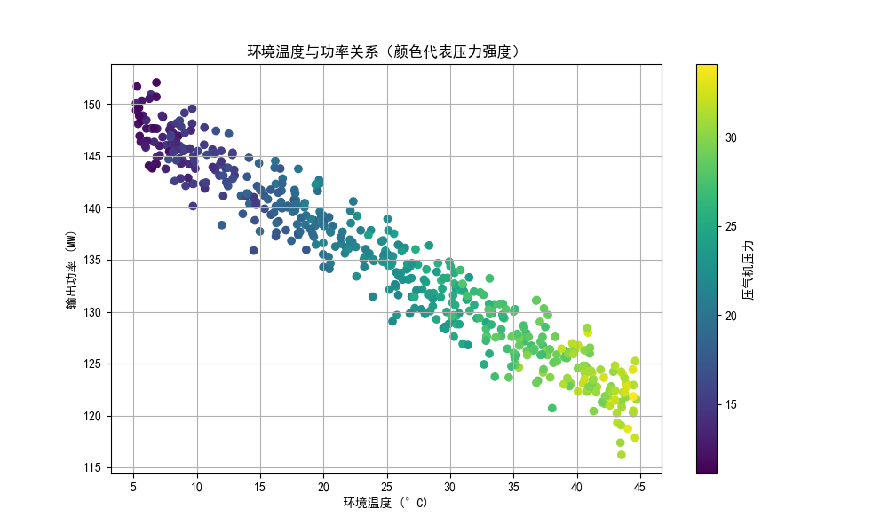

# Gas Turbine Performance Data Analysis

## 📌 Project Overview
This project focuses on analyzing the impact of environmental factors on **Gas Turbine Output Power**. As an Energy and Power Engineering student, I leveraged Python to simulate and analyze sensor data to understand thermodynamic performance under varying conditions.

## 🛠️ Tech Stack
- **Language:** Python
- **Libraries:** Pandas (Data Processing), Matplotlib & Seaborn (Visualization), NumPy (Simulation)

## 📊 Key Insights
- **Temperature Impact:** A clear negative correlation was observed between ambient temperature and power output.
- **Data Cleaning:** Implemented outlier detection to remove faulty sensor readings (simulated noise).
- **Correlation:** Proved that ambient temperature is the primary driver of efficiency loss in this model.

## 📈 Visualizations

## 📂 Project Structure
- `Gas_Turbine_Analysis.ipynb`: Main analysis notebook.
- `sensor_data.csv`: Cleaned dataset used for analysis.
- `performance_chart.png`: Visualized result of the study.
